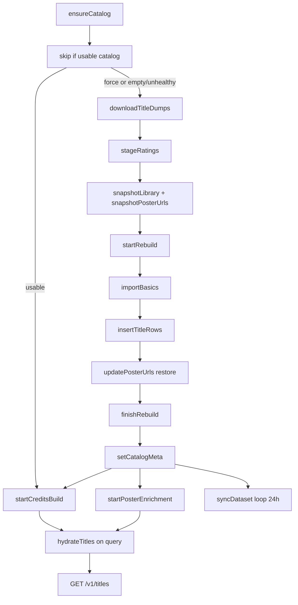
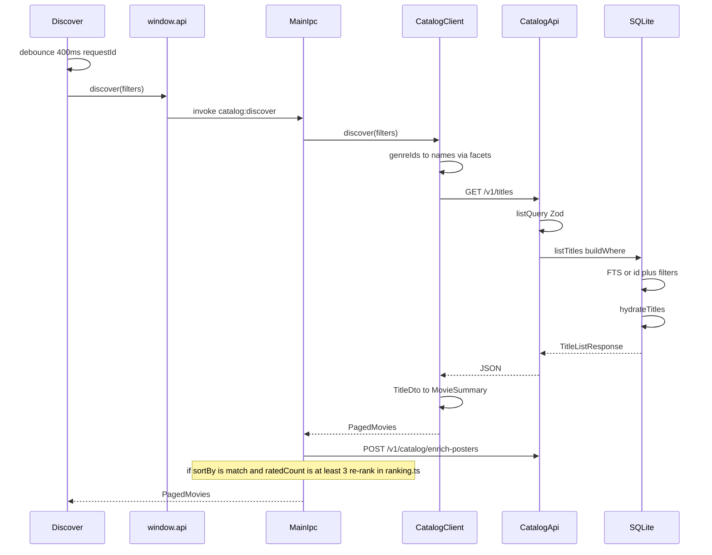

# Cataloguing System Technical Specification

This document is an implementation contract for IMDBrain’s cataloguing system. An agent following it must reproduce the same behavior, constants, schemas, HTTP shapes, and search semantics. Operator-facing setup remains in the root `README.md` and `apps/api/README.md`; this spec does not replace those files.

**In scope:** SQLite catalogue, IMDb dump ingest, credits import, FTS/filter query, SQL hydration, TMDB poster/synopsis overlay, licensed overlay import, ratings sync, health/readiness, Electron catalog runtime, and Discover search over IPC/HTTP.

**Out of scope:** taste-ranking weights and modes, For You insight copy, IMDb ratings CSV library import UX, Settings chrome, search-history `localStorage`. Ranking appears only as a labeled post-query desktop step in the search sequence.

---

## 1. Purpose

The cataloguing system is the self-hosted title index that the desktop app searches. It downloads IMDb’s non-commercial datasets, keeps movies / TV series / mini-series in SQLite keyed by IMDb `tt` ids, and serves filtered, paginated title pages to Electron over a local HTTP API.

Library state (watched / watchlist / skipped, personal rating, note) lives in the **same** SQLite file because search filters and For You candidate selection depend on it. Public IMDb ratings and vote counts are refreshed from the daily ratings dump. Optional TMDB lookups and licensed manifests overlay posters and synopses; they are not required for search.

The catalogue is not a remote movie API. The desktop app never downloads IMDb dumps and never calls TMDB. It talks only to the catalog API.

---

## 2. System boundaries

Two npm workspace packages:

| Package | Path | Role |
| --- | --- | --- |
| `@imdbrain/api` | `apps/api` | Express catalog API: build, store, query, hydrate, enrich, serve |
| `imdbrain` | `apps/desktop` | Electron app: spawn/adopt the API, IPC, Discover UI, DTO mapping |

Default API origin: `http://127.0.0.1:3847` (`DEFAULT_CATALOG_API_URL`, `PORT` default `3847`). CORS allows missing `Origin` or `http(s)://localhost|127.0.0.1(:port)`. JSON body limit is `15mb`. Zod failures return `400` `{ error: "Invalid request", details }`.

Electron spawns the API **only** when the configured URL host is `127.0.0.1` or `localhost`. Remote URLs must already be running. Spawn env:

- Dev: `IMDB_DATA_DIR = <apiRoot>/data`, `CATALOG_DB_PATH = <apiRoot>/data/catalog.sqlite`
- Packaged: `IMDB_DATA_DIR = <userData>/data`, `CATALOG_DB_PATH = <userData>/data/catalog.sqlite`
- `PORT` from the configured URL
- `TMDB_API_KEY` copied from desktop settings when set

Desktop `CatalogStatus.phase` values: `"starting" | "building" | "ready" | "error"`. API `CatalogPhase` values: `"idle" | "building" | "ready" | "error"`.

---

## 3. Feature composition

| Feature | Contract | Owner |
| --- | --- | --- |
| Local SQLite catalogue | WAL, `busy_timeout=5000`, `foreign_keys=ON`, migrations 1–6 | `apps/api/src/catalog/schema.ts`, `database.ts` |
| IMDb dump ingest | Parallel download of ratings + basics; keep movie/tv/miniseries, non-adult, rated, non-empty title | `apps/api/src/build/`, `apps/api/src/services/gzip-tsv.ts` |
| Credits import | Background after titles; max 4 directors, max 8 cast; display names only | `apps/api/src/build/import-credits.ts`, `apps/api/src/build/types.ts` |
| Ratings sync | Daily `title.ratings.tsv.gz`; in-memory store then chunked SQLite UPDATE; no new titles | `apps/api/src/services/dataset.ts`, `ratings-store.ts` |
| Bayesian catalogue sort | `bayesian_score = (votes / (votes + 25000)) * rating`; `sort=rating` uses this column | `apps/api/src/catalog/bayesian.ts` |
| FTS5 search | `titles_fts` on `title`, `original_title`, `id`; prefix AND; exact `tt` id bypasses FTS | `apps/api/src/catalog/query.ts` |
| SQL hydration | Batch-load genres + people into `TitleDto` | `apps/api/src/catalog/hydrate.ts` |
| TMDB media overlay | Optional `poster_url` + `synopsis` only; miss stored as `""`; `/v1/media` disk cache | `apps/api/src/services/tmdb-posters.ts`, `apps/api/src/routes/media.ts` |
| Licensed overlay | `POST /v1/imports/catalog`, version `1`, max 50_000 titles, provider-neutral JSON | `apps/api/src/routes/v1.ts`, `CatalogDatabase.upsertTitles` |
| Readiness | Titles usable before credits | `apps/api/src/catalog/meta.ts`, `apps/api/src/services/ensure-catalog.ts` |
| Desktop catalog runtime | Spawn/adopt localhost API, poll `/health`, push `catalog:status` | `apps/desktop/src/main/catalog-runtime.ts` |
| Work queue | Serializes ratings upserts, poster writes, `ANALYZE` | `apps/api/src/catalog/work-queue.ts` |

---

## 4. Canonical types and schema

### 4.1 Identity

Canonical title key is an IMDb id matching `/^tt\d+$/i`, stored and compared in **lowercase**.

### 4.2 `TitleDto` (API response)

```typescript
interface TitleDto {
  id: string;
  title: string;
  originalTitle: string | null;
  kind: string;
  year: number | null;
  runtimeMinutes: number | null;
  synopsis: string | null;
  posterUrl: string | null;
  imdbRating: number | null;
  imdbVotes: number | null;
  genres: string[];
  directors: string[];
  cast: string[];
}
```

`posterUrl` is `row.poster_url || null` (empty string becomes `null` in JSON). `synopsis` is the column as stored (empty string stays `""` if written). Directors and cast are display names, ordered by `position`. There are no `nm` ids in API responses.

```typescript
interface TitleListResponse {
  data: TitleDto[];
  pagination: { page: number; pageSize: number; total: number; totalPages: number };
}

interface FacetsResponse {
  genres: Array<{ value: string; count: number }>;
  kinds: Array<{ value: string; count: number }>;
  years: { min: number | null; max: number | null };
}

type LibraryStatus = "watched" | "watchlist" | "skipped";

interface LibraryEntryDto {
  title: TitleDto;
  status: LibraryStatus;
  personalRating: number | null;
  note: string | null;
  updatedAt: string;
}

interface ImportStatusDto {
  id: string;
  kind: "catalog" | "ratings";
  status: "running" | "completed" | "failed";
  startedAt: string;
  finishedAt: string | null;
  importedTitles: number;
  message: string | null;
}

interface ForYouResponse {
  library: LibraryEntryDto[];
  facets: FacetsResponse;
  candidates: TitleDto[];
}
```

### 4.3 `TitleQuery` (internal query object after Zod)

```typescript
interface TitleQuery {
  page: number;
  pageSize: number;
  sort: "title" | "year" | "rating" | "votes" | "updatedAt";
  order: "asc" | "desc";
  query?: string;
  genre?: string;
  kind?: string;
  yearMin?: number;
  yearMax?: number;
  ratingMin?: number;
  votesMin?: number;
  hideWatched?: boolean;
  hideWatchlist?: boolean;
  genres?: string[];
  runtimeMin?: number;
  runtimeMax?: number;
  includeTotal?: boolean;
}
```

### 4.4 Title kinds (IMDb `titleType` → stored `kind`)

| IMDb `titleType` (case-insensitive) | Stored `kind` |
| --- | --- |
| `movie` | `movie` |
| `tvSeries` | `tv` |
| `tvMiniSeries` | `miniseries` |
| anything else | **excluded** |

### 4.5 Import filters (`importBasics`)

Keep a `title.basics` row only if all of:

1. Column 0 (`tconst`) is a non-empty IMDb value, lowercased.
2. `mapKind(titleType)` is non-null.
3. `isAdult` (column 4) is not `"1"`.
4. A ratings row exists in `ratings_staging` for that id.
5. Primary title (column 2) is non-empty (`imdbValue` rejects `""` and `\N`).

Year: integer 1870–3000, else `null`. Runtime: integer 1–2000, else `null`. Genres: comma-split, trimmed, unique, skip `\N`.

### 4.6 SQLite schema (migrations 1–6)

Pragmas on open: `foreign_keys=ON`, `journal_mode=WAL`, `busy_timeout=5000`. During title/credits rebuild: `foreign_keys=OFF`, `synchronous=OFF`; restored to `synchronous=NORMAL`, `foreign_keys=ON` on finish.

**`titles`**

| Column | Type | Notes |
| --- | --- | --- |
| `id` | TEXT PK | lowercase `tt…` |
| `title` | TEXT NOT NULL | |
| `original_title` | TEXT | |
| `kind` | TEXT NOT NULL DEFAULT `'movie'` | `movie` \| `tv` \| `miniseries` |
| `year` | INTEGER | |
| `runtime_minutes` | INTEGER | |
| `synopsis` | TEXT | TMDB/licensed; `NULL` = pending, `''` = confirmed miss |
| `poster_url` | TEXT | same NULL vs `''` rule |
| `imdb_rating` | REAL | |
| `imdb_votes` | INTEGER | |
| `bayesian_score` | REAL | persisted; used for `sort=rating` |
| `updated_at` | TEXT NOT NULL | |

**`title_genres`:** `(title_id, genre)` PK, FK `titles(id)` ON DELETE CASCADE.

**`title_people`:** `(title_id, name, role)` PK, `role` CHECK `('director','cast')`, `position` INTEGER NOT NULL.

**`library_entries`:** `title_id` PK FK, `status` CHECK `('watched','watchlist','skipped')`, `personal_rating`, `note`, `updated_at`.

**`catalog_meta`:** `(key, value)` key/value. Written keys include `builtAt`, `revision`, `source`, `titlesReady` (`"1"`), flags `buildInProgress`, `creditsReady`, `creditsInProgress`.

**`imports`:** import job rows.

**`ratings_staging`:** temp table for bulk rating loads (`id` PK, `rating`, `votes`).

**`titles_fts`:** FTS5 virtual table, `content='titles'`, `content_rowid='rowid'`, columns `title`, `original_title`, `id`. INSERT/UPDATE/DELETE triggers keep it in sync.

Indexes: `titles_sort_idx(kind, year, imdb_rating, imdb_votes)`, `titles_title_idx(title COLLATE NOCASE)`, `titles_votes_idx(kind, imdb_votes)`, `titles_runtime_idx(kind, runtime_minutes)`, `titles_bayesian_idx(kind, bayesian_score DESC)`, `title_genres_genre_idx(genre)`, `titles_poster_pending_idx` / `titles_enrich_pending_idx` on pending poster/synopsis.

### 4.7 Bayesian score

```
BAYESIAN_PRIOR_VOTES = 25000
bayesianScore(rating, votes) = (count / (count + 25000)) * score
```

where `score = rating ?? 0` and `count = votes ?? 0`. Written on insert and on every ratings update. `ORDER BY t.bayesian_score` for `sort=rating`, **not** raw `imdb_rating`.

### 4.8 Constants

| Name | Value |
| --- | --- |
| `PORT` | `Number(process.env.PORT) \|\| 3847` |
| `IMDB_DATASETS_BASE` | `https://datasets.imdbws.com` |
| `DATASET_URL` | `${IMDB_DATASETS_BASE}/title.ratings.tsv.gz` |
| `DATA_DIR` | `process.env.IMDB_DATA_DIR ?? join(process.cwd(), "data")` |
| `CATALOG_DB_PATH` | `process.env.CATALOG_DB_PATH ?? join(DATA_DIR, "catalog.sqlite")` |
| `POSTER_CACHE_DIR` | `process.env.POSTER_CACHE_DIR ?? join(DATA_DIR, "posters")` |
| `SYNC_INTERVAL_MS` | `24 * 60 * 60 * 1000` |
| `MAX_RATING_IDS` | `200` |
| `TMDB_API_BASE` | `https://api.themoviedb.org/3` |
| `TMDB_IMAGE_BASE` | `https://image.tmdb.org/t/p/original` |
| `TMDB_POSTER_CONCURRENCY` | `max(1, Number(process.env.TMDB_CONCURRENCY) \|\| 3)` |
| `TMDB_POSTER_PAGE_SIZE` | `max(50, Number(process.env.TMDB_POSTER_PAGE) \|\| 400)` |
| `MAX_DIRECTORS` | `4` |
| `MAX_CAST` | `8` |
| `TITLE_BATCH` | `2000` |
| `PERSON_BATCH` | `5000` |
| `STAGING_BATCH` | `5000` |
| `RATING_CHUNK` | `5000` |
| Count cache TTL | `30_000` ms |
| Facets cache TTL | `10 * 60 * 1000` ms |
| Media cache `Cache-Control` | `public, max-age=604800, immutable` |
| Gzip reuse min size | `64` bytes, magic `0x1f 0x8b` |
| JSON body limit | `15mb` |
| Licensed import cap | `50_000` titles, `version: 1` |
| API list `pageSize` default | `25` (max `100`; `limit` overrides `pageSize`) |
| Desktop discover `pageSize` | `40` |
| For You candidate `imdb_votes` floor | `5000` |
| For You default/desktop limit | `250` (API max `500`) |
| Desktop HTTP retries | search: 2 / 4000 ms; health: 1 / 1000 ms; long: 4 / 20000 ms |

On-disk dump files under `DATA_DIR`:

- `title.ratings.tsv.gz` + `.meta.json`
- `title.basics.tsv.gz` + `.meta.json`
- `title.crew.tsv.gz`, `title.principals.tsv.gz`, `name.basics.tsv.gz` (+ meta)
- `catalog.sqlite` (+ WAL/SHM)
- `posters/` (proxied TMDB images)

---

## 5. Pipeline: fetch → process → hydrate → serve

“Hydrate” means two different things. Do not conflate them:

1. **SQL hydration** (`hydrateTitles`): after a title-row SELECT, batch-load `title_genres` and `title_people` into `TitleDto`.
2. **TMDB media fill** (`findTitleMedia` / `updatePosterUrls`): write `poster_url` and `synopsis` onto existing title rows.



### 5.1 Stage table

| Stage | Function | Behavior |
| --- | --- | --- |
| Skip-if-usable | `ensureCatalog` / `catalogIsUsable` | Skip rebuild when `titleCount > 0` AND `builtAt` set AND `isHealthy()` unless `force: true`. If a leftover `buildInProgress` flag is set, clear it. Still call `startCreditsBuild` (no-op if credits already ready). |
| Dump reuse | `ensureGzipFile(..., force=false)` | HEAD probe; reuse local gzip if valid magic/size and ETag or Last-Modified or Content-Length match `{file}.meta.json`. Incomplete `.tmp` files deleted on API start. |
| Title dumps | `downloadTitleDumps` | Parallel: `title.ratings.tsv.gz` and `title.basics.tsv.gz`. Progress reported into catalog status `download`. |
| Stage ratings | `stageRatings` | Stream ratings TSV into `ratings_staging`. |
| Snapshot | `snapshotLibrary`, `snapshotPosterUrls` | Preserve library rows and any non-null poster/synopsis before DELETE. |
| Rebuild start | `startRebuild` | FKs off. DELETE `title_people`, `title_genres`, `titles`. Library is **not** relied on to cascade (FKs are off); `finishRebuild` deletes `library_entries` then restores the snapshot. Invalidate facet + count caches. FTS triggers fire on DELETE/INSERT. |
| Import titles | `importBasics` → `insertTitleRows` | Batches of 2000; compute `bayesian_score`; insert genres. |
| Restore media | `updatePosterUrls` | Restore poster/synopsis for ids still in `titleIdSet()`. `updatePosterUrls` never overwrites a non-NULL column; null incoming values become `""`. |
| Finish titles | `finishRebuild` | DELETE remaining library, restore snapshotted entries whose `title_id` still exists. Re-enable FKs. |
| Meta | `setCatalogMeta` | `builtAt` ISO now, `revision = builtAt`, `source = "imdb-noncommercial-datasets"`, `titlesReady=1`. Clear `buildInProgress`. `queueAnalyze()`. |
| Credits (API vs CLI) | `startCreditsBuild` / `buildCatalog` | After titles, `ensureCatalog` (API startup and `POST /v1/catalog/rebuild`) calls `void startCreditsBuild` — credits run in the **background** so search can open. CLI `npm run build:catalog` calls `buildCatalog`, which **awaits** credits before returning. `runBuildTitles` ignores `options.force` for dumps (`ensureGzipFile(..., false)` always). `--force` on the CLI is accepted but does not re-download unchanged dumps; the CLI always rebuilds SQLite because it does not go through `catalogIsUsable`. |
| Credits import | `runBuildCredits` | Skip if `creditsReady && !creditsInProgress`. Download crew/principals/names. `startCreditsRebuild` deletes only `title_people`. Directors: first 4 `nconst` from `title.crew`. Cast: `actor`/`actress` principals, trim to 8 by ordering. Resolve names from `name.basics`. `insertPeople` batches of 5000. Set `creditsReady`. `ANALYZE title_people`. Failure logs a warning; titles stay usable. |
| TMDB overlay | `startPosterEnrichment` | No-op without `TMDB_API_KEY` or desktop settings key. Priority ids first, then `imdb_votes DESC` where `poster_url IS NULL OR synopsis IS NULL`. `GET {TMDB_API_BASE}/find/{imdbId}?external_source=imdb_id&language=en-US`. Prefer `tv_results` for `tv`/`miniseries`, else `movie_results`. Poster URL = `TMDB_IMAGE_BASE + poster_path`. Miss writes `""`. Concurrency default 3, page size default 400. 429 retries; 401/403 abort. |
| Ratings loop | `syncDataset` | On startup after ensure, then every `SYNC_INTERVAL_MS`. Re-download ratings if missing, stale (>24h mtime), or `force`. `RatingsStore.replace` loads the map, then `upsertRatingsChunked` UPDATEs existing title rows only; when that persist finishes the in-memory map is cleared and `POST /ratings` falls back to SQLite. Failed refresh keeps last good in-memory set if already ready. |
| Work queue | `catalogWorkQueue` | One-at-a-time: chunked rating writes, queued poster updates, ANALYZE. |
| Serve | `listTitles` | `buildWhere` + ORDER BY + LIMIT/OFFSET + `hydrateTitles`. |

Usable catalog after titles are imported: search works with empty `directors`/`cast` until credits finish (`titlesReady` does not require `creditsReady`).

Licensed overlay is a parallel ingest path, not part of the IMDb rebuild: `POST /v1/imports/catalog` upserts supplied metadata (replaces genres/people for those ids), then applies in-memory ratings for those ids. On `ON CONFLICT(id)`, the upsert updates title/kind/year/runtime/synopsis/poster/`updated_at` only — it does **not** overwrite `imdb_rating`, `imdb_votes`, or `bayesian_score`. New rows insert those rating columns as null, then `upsertRatings` fills them from `RatingsStore`. Ratings remain IMDb-synced via `/sync` and the daily job.

---

## 6. Search end-to-end



### 6.1 Renderer

`apps/desktop/src/renderer/src/views/Discover.tsx`:

- Filter changes (everything except paging) produce a `filterKey`; search fires after `SEARCH_DEBOUNCE_MS = 400`.
- Calls `window.api.discover({ ...filters, page })`.
- Stale responses dropped via incrementing `requestId`.
- Page 1 replaces results and opens the first title. Later pages append (infinite scroll).
- Page size is **not** set in the renderer; main hardcodes `40`.

App boot (`App.tsx`) blocks on `catalog:status` until `phase === "ready"` (`CatalogLoader` during `starting`/`building`).

### 6.2 Default Discover filters

From `defaultFilters()`:

| Field | Default |
| --- | --- |
| `query` | `""` |
| `titleKind` | `"movie"` |
| `genres` | `[]` |
| `yearMin` | `2000` |
| `yearMax` | current calendar year |
| `ratingMin` | `7` |
| `voteCountMin` | `1000` |
| `hideWatched` | `true` |
| `hideWatchlist` | `false` |
| `sortBy` | `"match"` |
| `page` | `1` |
| `runtimeMin` / `runtimeMax` | `null` |

### 6.3 Wired vs unwired filters

| `DiscoverFilters` field | Sent to API? | Mapping |
| --- | --- | --- |
| `query` | yes | `query` (omitted if empty) |
| `titleKind` | yes | `kind` (`movie` \| `tv` \| `miniseries`) |
| `genres` (numeric ids) | yes | comma-separated **names** via `/v1/facets` + `genreId` hash |
| `yearMin` / `yearMax` | yes | same names |
| `ratingMin` | yes | omitted if `0` |
| `voteCountMin` | yes | `votesMin`; omitted if `0` |
| `runtimeMin` / `runtimeMax` | yes | omitted if null |
| `hideWatched` / `hideWatchlist` | yes | `"true"` only when true |
| `sortBy` | yes | see sort map |
| `page` | yes | `page`; `includeTotal` is `"false"` when `page > 1` else `"true"` |
| `withoutGenres` | **no** | unused |
| `ratingMax` | **no** | type default `10`; `matchesRatingFilters` exists but is not on the discover path |
| `language` | **no** | unused |
| `cast` / `directors` / `keywords` / `providers` | **no** | IPC stubs return `[]` |

**Always-on catalogue rule (not a UI toggle):** search `WHERE` always includes

```sql
NOT EXISTS (
  SELECT 1 FROM library_entries skipped
  WHERE skipped.title_id = t.id AND skipped.status = 'skipped'
)
```

Genre filter semantics: `EXISTS (… g.genre IN (…))` — **OR** across selected genres.

### 6.4 Sort mapping (desktop `sortBy` → API)

| UI `sortBy` | API `sort` | API `order` |
| --- | --- | --- |
| `match` | `votes` | `desc` |
| `vote_average.desc` | `rating` | `desc` |
| `vote_count.desc` | `votes` | `desc` |
| `popularity.desc` | `votes` | `desc` |
| `primary_release_date.desc` | `year` | `desc` |
| `primary_release_date.asc` | `year` | `asc` |
| default | `title` | `asc` |

SQL sort columns:

| API `sort` | SQL |
| --- | --- |
| `title` | `t.title COLLATE NOCASE` |
| `year` | `t.year` |
| `rating` | `t.bayesian_score` |
| `votes` | `t.imdb_votes` |
| `updatedAt` | `t.updated_at` |

Tie-breaker always: `t.id ASC`. Order is `ASC` only when `query.order` uppercases to `"ASC"`; anything else is `DESC`.

### 6.5 Query construction (`buildWhere`)

1. If `query` trimmed matches `/^tt\d+$/i` → `t.id = @id` (lowercased). **No FTS.**
2. Else tokenize: strip `"*():^,-`, split on whitespace, strip non-letter/number per Unicode, drop empty. If any tokens remain, FTS5 `MATCH` `token1* AND token2* AND …` and `JOIN titles_fts f ON f.rowid = t.rowid`.
3. Optional genre IN-list EXISTS, exact `kind`, range filters on `year`, `imdb_rating`, `imdb_votes`, `runtime_minutes`.
4. Always exclude skipped.
5. Optional hide watched / hide watchlist via NOT EXISTS.

### 6.6 Pagination and totals

- Offset = `(page - 1) * pageSize`.
- Count cache: 30s TTL keyed by `{ condition, params, fts }`.
- `includeTotal !== false` (desktop page 1): run COUNT unless cache hit.
- `includeTotal === false` (desktop page > 1): use cache if present; else if this page is short, `total = offset + rows.length`; else `total = offset + rows.length + 1` (estimate). `totalPages = max(1, ceil(total / pageSize))`.

### 6.7 DTO mapping (`TitleDto` → `MovieSummary`)

`genreId(name)`: FNV-like hash — start `7`, for each lowercased char `hash = (hash * 31 + charCode) >>> 0`. Same helper hashes director and cast names to numeric ids for UI chips. Not TMDB ids; must use this algorithm or chips will not round-trip.

- `id` → `imdbId` lowercased
- `kind` → `titleKind` / `mediaType` (`mini` → miniseries, `tv`/`series` → tv, else movie)
- `synopsis` → `overview`
- `posterUrl` → `posterPath` (renderer later rewrites TMDB URLs through `GET /v1/media?src=`)
- `imdbRating` / `imdbVotes` → `voteAverage` / `voteCount` (`0` if null)
- `year` → `releaseDate` `${year}-01-01` when year present

### 6.8 Post-query steps (desktop main)

After a successful discover:

1. Fire-and-forget `POST /v1/catalog/enrich-posters` with visible IMDb ids, current filter query, `extraPages: 2` (look-ahead pages of the same query, pageSize 40).
2. If `sortBy === "match"` **and** taste profile `ratedCount >= 3`, re-sort the **current page** with `scoreMovie` / `sortMovies("match")` in `apps/desktop/src/main/ranking.ts`. Do not reimplement ranking here. If `ratedCount < 3`, return API vote-desc order unchanged.

Network-down (`CatalogError.status === 0`) on discover returns empty `{ page: 1, totalPages: 0, totalResults: 0, results: [] }` instead of throwing.

### 6.9 For You catalogue query (not ranking)

`GET /v1/for-you?limit=` (default 250, max 500) returns `{ library, facets, candidates }` where candidates are:

```sql
SELECT t.* FROM titles t
WHERE t.imdb_votes >= 5000
  AND NOT EXISTS (
    SELECT 1 FROM library_entries e
    WHERE e.title_id = t.id AND e.status IN ('watched','skipped')
  )
ORDER BY t.imdb_votes DESC, t.id ASC
LIMIT ?
```

then `hydrateTitles`. Desktop scores these and slices to 40; that scoring is out of this spec.

---

## 7. HTTP and IPC contracts

### 7.1 HTTP

Base: `http://127.0.0.1:3847`. v1 mounted at `/v1`.

| Method | Path | Status | Request | Response |
| --- | --- | --- | --- | --- |
| `GET` | `/health` | 200 | — | `HealthResponse` below |
| `GET` | `/v1/titles` | 200 / 400 | `listQuery` | `TitleListResponse` |
| `GET` | `/v1/titles/:id` | 200 / 404 | `tt` id | `{ data: TitleDto }`; if `titleNeedsMedia` (`poster_url` or `synopsis` IS NULL) and TMDB key exists, `enrichOneTitle` then re-read |
| `GET` | `/v1/facets` | 200 | — | `FacetsResponse`. In-memory 10 min TTL. Genres: `GROUP BY genre ORDER BY count DESC, genre`. Kinds: `GROUP BY kind ORDER BY count DESC, kind`. Years: `min(year)`, `max(year)`. |
| `GET` | `/v1/for-you` | 200 | `limit` 1–500 default 250 | `ForYouResponse` |
| `GET` | `/v1/media?src=` | 200 / 400 / 404 / 502 | https URL on `image.tmdb.org` \| `media.themoviedb.org` \| `www.themoviedb.org` | image bytes, disk cache under `POSTER_CACHE_DIR/{size}/{sha1}{ext}` |
| `GET` | `/v1/library` | 200 | optional `status` | `{ data: LibraryEntryDto[] }` newest `updated_at` first |
| `PUT` | `/v1/library/:id` | 200 / 404 | `{ status, personalRating?, note? }` | `{ data: LibraryEntryDto }`. If `status==="watched"` and `personalRating` is provided it must not be `null`. |
| `DELETE` | `/v1/library/:id` | 204 / 404 | — | empty |
| `POST` | `/v1/catalog/rebuild` | 202 / 409 | `{ force?: boolean }` | `{ ok: true, ...catalogStatus() }`. Always starts `ensureCatalog({ force: true })` if not already building. Then ratings sync + poster enrichment. |
| `POST` | `/v1/catalog/enrich-posters` | 202 | optional `ids` (max 400), `extraPages` 0–5, plus list-query fields | `{ ok: true, running }` |
| `POST` | `/v1/imports/catalog` | 201 / 400 | manifest below | `{ data: ImportStatusDto }`. Completes synchronously. Duplicate ids rejected. |
| `GET` | `/v1/imports/:id` | 200 / 404 | UUID | `{ data: ImportStatusDto }` |
| `POST` | `/ratings` | 200 / 400 / 503 | `{ ids: tt[] }` max 200 | `{ syncedAt, ratings }` from `RatingsStore` |
| `POST` | `/sync` | 200 | — | force ratings file refresh `{ ok, ready, syncedAt, titleCount }` |

**`listQuery` (GET `/v1/titles`):**

| Param | Constraint | Default |
| --- | --- | --- |
| `page` | int 1–100000 | 1 |
| `pageSize` | int 1–100 | 25 |
| `limit` | int 1–100 | overrides `pageSize` if set |
| `sort` | `title\|year\|rating\|votes\|updatedAt` | `title` |
| `order` | `asc\|desc` | `asc` |
| `query` | trim, 1–200 chars | omitted |
| `genre` | string or array, split commas, max 30 names × 60 chars | → `genres` |
| `kind` | 1–40 chars | omitted |
| `yearMin` / `yearMax` | int 1870–3000; min ≤ max | omitted |
| `ratingMin` | 0–10 | omitted |
| `votesMin` | 0–2_000_000_000 | omitted |
| `runtimeMin` / `runtimeMax` | 1–2000 | omitted |
| `hideWatched` / `hideWatchlist` | `"true"` / `"false"` | omitted |
| `includeTotal` | `"true"` / `"false"` | true |

**HealthResponse:**

```typescript
{
  ok: true,
  ready: titleCount > 0 && !building && phase !== "error",
  building: phase === "building",
  catalogPhase: "idle" | "building" | "ready" | "error",
  catalogMessage: string,
  catalogError: string | null,
  catalogDownload: {
    file: string,
    fileIndex: number,
    fileCount: number,
    receivedBytes: number,
    totalBytes: number | null
  } | null,
  syncedAt: string | null,
  titleCount: number,
  ratingsCount: number,
  catalogBuiltAt: string | null,
  catalogRevision: string | null,
  titlesReady: boolean,
  creditsReady: boolean
}
```

`titlesReady` = `titleCount > 0 && Boolean(builtAt)`. `creditsReady` = meta flag `creditsReady=1` **or** any `title_people` row exists.

**Licensed manifest:**

```json
{
  "version": 1,
  "titles": [{
    "id": "tt0111161",
    "title": "The Shawshank Redemption",
    "kind": "movie",
    "year": 1994,
    "runtimeMinutes": 142,
    "genres": ["Drama"],
    "directors": ["Frank Darabont"],
    "cast": ["Tim Robbins", "Morgan Freeman"]
  }]
}
```

Optional per title: `originalTitle`, `synopsis`, `posterUrl` (URL). Upsert replaces metadata/genres/cast/directors for each id; does not delete unspecified titles. IMDb ratings applied from `RatingsStore` after upsert (`imdbRating`/`imdbVotes` on the upsert SQL are written null then filled from the store).

### 7.2 Desktop IPC (cataloguing)

Invoke (renderer → main):

| Channel | Preload | Handler |
| --- | --- | --- |
| `catalog:configured` | `configured()` | `GET /health` → `ready` |
| `catalog:status` | `catalogStatus()` | runtime snapshot |
| `catalog:retry` | `retryCatalog()` | restart bootstrap |
| `catalog:rebuild` | `rebuildCatalog()` | `POST /v1/catalog/rebuild` `{ force: true }` |
| `catalog:genres` | `genres()` | `GET /v1/facets` → `{ id: genreId(name), name }` |
| `catalog:discover` | `discover(filters)` | section 6 |
| `catalog:title` | `movie(id)` | `GET /v1/titles/:id` |
| `catalog:providers` | `providers()` | **stub `[]`** |
| `catalog:searchPeople` | `searchPeople()` | **stub `[]`** |
| `catalog:searchKeywords` | `searchKeywords()` | **stub `[]`** |
| `library:list` | `listLibrary()` | `GET /v1/library` |
| `library:upsert` | `upsertLibrary()` | `PUT /v1/library/:id` |
| `library:remove` | `removeLibrary()` | `DELETE /v1/library/:id` |

Push (main → renderer): `catalog:status` with `CatalogStatus`.

Runtime poll: `POLL_MS = 250`, start timeout `30_000`. Rebuild 409 is treated as already in progress, not an error.

### 7.3 CLI (catalogue)

| Command | Effect |
| --- | --- |
| `npm run dev:api` | API with `tsx watch` |
| `npm run build:catalog` | always rebuilds SQLite titles then **waits** for credits; dumps reused unless remote HEAD changed; `--force` does not skip `catalogIsUsable` (CLI never checks it) and does not force dump re-download |
| `npm run enrich:posters` | TMDB backfill |
| `npm run migrate -w @imdbrain/api` | apply SQLite migrations |
| `npm test` | `@imdbrain/api` tests including `catalog.test.ts` |

---

## 8. Invariants and parity checklist

Behavioral tests in `apps/api/src/catalog/catalog.test.ts` plus live query/build rules. A parity implementation must satisfy all of these.

1. **Titles ready without credits.** After inserting titles and `setCatalogMeta({ builtAt, revision, source })`, `titlesReady() === true` and `creditsReady() === false` until people exist or the credits flag is set.
2. **Batch SQL hydration.** `listTitles` attaches genres (alphabetical from `ORDER BY genre`) and people (`ORDER BY role, position`, bucketed into `directors` / `cast`).
3. **Rating sort uses bayesian_score.** A 10.0 title with 12 votes ranks below a 9.0 title with 500_000 votes when `sort=rating&order=desc`.
4. **FTS prefix.** Query `"matr"` matches title `"The Matrix"` and not unrelated titles.
5. **Exact IMDb id.** Query `"tt0133093"` uses `t.id` equality, not FTS.
6. **`includeTotal: false` still pages.** A full page estimates `total >= actual` so clients can request the next page.
7. **For You candidates exclude watched and skipped.** `imdb_votes >= 5000`; watchlist titles may still appear; watched/skipped must not.
8. **Skipped titles never appear in `/v1/titles` search**, even if `hideWatched`/`hideWatchlist` are unset.
9. **Rebuild preserves library and media** for surviving title ids: snapshot before DELETE, restore only rows whose `title_id` still exists after import. Dropped titles are not restored. Do not depend on FK CASCADE during rebuild (FKs are off).
10. **Ratings-only sync does not insert titles.**
11. **TMDB miss vs pending:** `NULL` = not looked up; `''` = looked up, none found; do not retry `''`. `updatePosterUrls` writes only when the column is currently `NULL`.
12. **Dump reuse** does not require `--force` on gzip files during SQLite rebuild; HEAD/ETag/size/gzip checks still skip re-download.
13. **IDs lowercased** at ingest, import, library, and query.
14. **Genre chips** round-trip only if desktop uses `genreId(name)` as specified.
15. **Credits caps:** ≤4 directors, ≤8 unique cast nconsts per title; unresolved nconsts omitted (no empty names).
16. **Health `ready`** is false while `building` or `error`, even if some titles exist.
17. **CORS** rejects non-localhost browser origins.
18. **People storage is names on titles**, not a people catalogue.

---

## 9. Explicit non-goals and stubs

Do **not** implement these as working catalogue features. They exist as TypeScript fields or IPC handlers that return empty.

- `catalog:providers`, `catalog:searchPeople`, `catalog:searchKeywords` → `[]`
- Discover fields `withoutGenres`, `cast`, `directors`, `keywords`, `providers`, `language`, `ratingMax` are not query parameters
- Separate people / keyword / watch-provider indexes
- Desktop-direct TMDB or IMDb HTTP
- Ranking algorithm, ranking modes, For You insight text, IMDb CSV import UI, search-history persistence
- `movieMeta` IPC (exists; Discover does not call it for catalogue search)
- Vendor-specific licensed bundle formats other than the version-1 JSON manifest above

Rebuilding this system with feature parity means matching sections 4–8, including constants, SQL semantics, and the Electron mapping in section 6. Ranking may differ without violating this spec, except that `sortBy === "match"` with fewer than 3 rated titles must leave API vote-desc order unchanged, and with 3 or more must re-rank the current page in the desktop main process rather than in SQLite.
