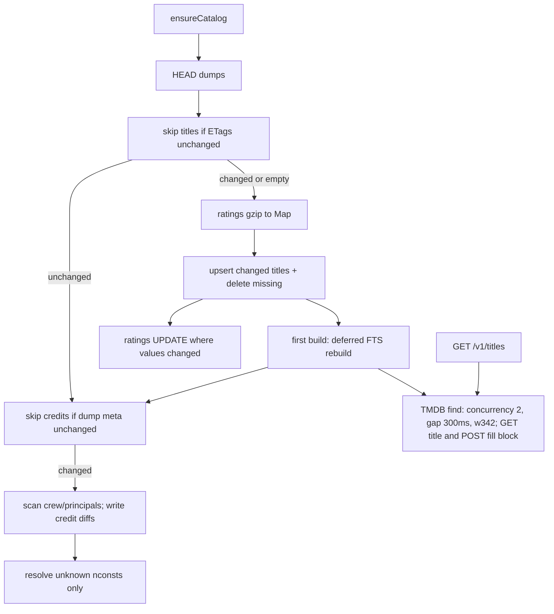
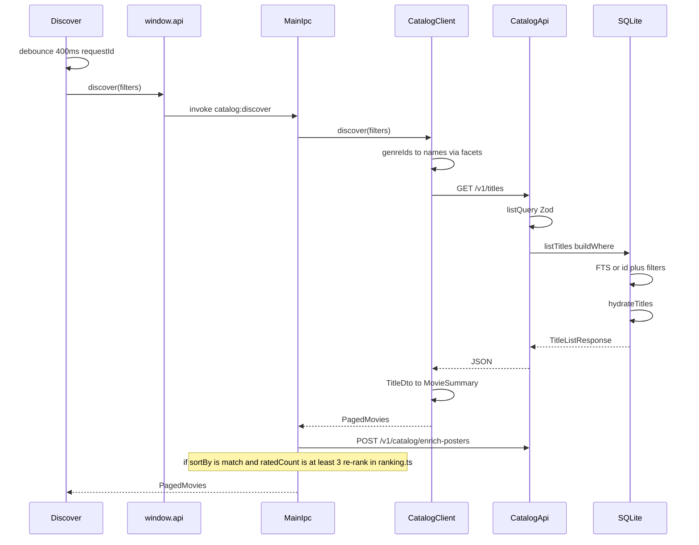

# Cataloguing System Technical Specification

This document is an implementation contract for IMDBrain’s cataloguing system. An agent following it must reproduce the same behavior, constants, schemas, HTTP shapes, and search semantics. Operator-facing setup remains in the root `README.md` and `apps/api/README.md`; this spec does not replace those files.

**In scope:** SQLite catalogue, IMDb dump ingest, credits import, FTS/filter query, SQL hydration, TMDB poster/synopsis overlay, licensed overlay import, ratings sync, health/readiness, Electron catalog runtime, and Discover search over IPC/HTTP.

**Out of scope:** taste-ranking weights and modes, For You insight copy, IMDb ratings CSV library import UX, Settings chrome. Ranking appears only as a labeled post-query desktop step in the search sequence. Search history persistence lives in the desktop `userData` store, not in the catalogue API.

---

## 1. Purpose

The cataloguing system is the self-hosted title index that the desktop app searches. It downloads IMDb’s non-commercial datasets, keeps movies / TV series / mini-series in SQLite keyed by IMDb `tt` ids, and serves filtered, paginated title pages to Electron over a local HTTP API.

Library state (watched / watchlist / skipped, personal rating, note) lives in the **same** SQLite file because search filters and For You candidate selection depend on it. Public IMDb ratings and vote counts are refreshed from the daily ratings dump. Optional TMDB lookups and licensed manifests overlay posters and synopses; they are not required for search.

The catalogue is not a remote movie API. The desktop app never downloads IMDb dumps and never calls TMDB. It talks only to the catalog API.

---

## 2. System boundaries

Two npm workspace packages:

| Package | Path | Role |
| --- | --- | --- |
| `@imdbrain/api` | `apps/api` | Express catalog API: build, store, query, hydrate, enrich, serve |
| `imdbrain` | `apps/desktop` | Electron app: spawn/adopt the API, IPC, Discover UI, DTO mapping |

Default API origin: `http://127.0.0.1:3847` (`DEFAULT_CATALOG_API_URL`, `PORT` default `3847`). CORS allows missing `Origin` or `http(s)://localhost|127.0.0.1(:port)`. JSON body limit is `15mb`. Zod failures return `400` `{ error: "Invalid request", details }`.

Electron spawns the API **only** when the configured URL host is `127.0.0.1` or `localhost`. Remote URLs must already be running. Spawn env:

- Dev: `IMDB_DATA_DIR = <apiRoot>/data`, `CATALOG_DB_PATH = <apiRoot>/data/catalog.sqlite`
- Packaged: `IMDB_DATA_DIR = <userData>/data`, `CATALOG_DB_PATH = <userData>/data/catalog.sqlite`
- `PORT` from the configured URL
- `TMDB_API_KEY` copied from desktop settings when set

Desktop `CatalogStatus.phase` values: `"starting" | "building" | "ready" | "error"`. API `CatalogPhase` values: `"idle" | "building" | "ready" | "error"`.

---

## 3. Feature composition

| Feature | Contract | Owner |
| --- | --- | --- |
| Local SQLite catalogue | WAL, `busy_timeout=5000`, `foreign_keys=ON`, migrations 1–11 | `apps/api/src/catalog/schema.ts`, `database.ts` |
| IMDb dump ingest | Parallel download of ratings + basics; keep movie/tv/miniseries, non-adult, rated, non-empty title; reconcile rather than wipe | `apps/api/src/build/`, `apps/api/src/services/gzip-tsv.ts` |
| Credits import | Background after titles; skip when dump fingerprints match; max 4 directors, max 8 cast; `people(nconst)` + JOIN for display names | `apps/api/src/build/import-credits.ts`, `apps/api/src/build/types.ts` |
| Ratings sync | Daily `title.ratings.tsv.gz`; gzip streamed into diff-only SQLite UPDATE; no new titles; in-memory Map only during title ingest | `apps/api/src/services/dataset.ts`, `ratings-store.ts` |
| IMDb rating sort | `sort=rating` → `ORDER BY t.imdb_rating, t.imdb_votes, t.id`; `bayesian_score` still persisted for ranking helpers | `apps/api/src/catalog/query.ts`, `bayesian.ts` |
| FTS5 search | `titles_fts` on `title`, `original_title`, `id`; prefix AND; exact `tt` id bypasses FTS | `apps/api/src/catalog/query.ts` |
| SQL hydration | Batch-load genres + people into `TitleDto` | `apps/api/src/catalog/hydrate.ts` |
| TMDB media overlay | Optional `poster_url`, `synopsis`, and `certification`; NULL pending, `""` completed miss (not retried); interactive GET title and POST fill block; `/v1/media` disk cache | `apps/api/src/services/tmdb-posters.ts`, `apps/api/src/routes/v1.ts`, `apps/api/src/routes/media.ts` |
| Licensed overlay | `POST /v1/imports/catalog`, version `1`, max 50_000 titles, provider-neutral JSON | `apps/api/src/routes/v1.ts`, `CatalogDatabase.upsertTitles` |
| Readiness | Titles usable before credits | `apps/api/src/catalog/meta.ts`, `apps/api/src/services/ensure-catalog.ts` |
| Desktop catalog runtime | Spawn/adopt localhost API, poll `/health`, push `catalog:status` | `apps/desktop/src/main/catalog-runtime.ts` |
| Work queues | `catalogWorkQueue` (ratings), `mediaWorkQueue` (poster writes), `maintenanceWorkQueue` (`ANALYZE` after 250ms idle) | `apps/api/src/catalog/work-queue.ts` |

---

## 4. Canonical types and schema

### 4.1 Identity

Canonical title key is an IMDb id matching `/^tt\d+$/i`, stored and compared in **lowercase**.

### 4.2 `TitleDto` (API response)

```typescript
interface TitleDto {
  id: string;
  title: string;
  originalTitle: string | null;
  kind: string;
  year: number | null;
  runtimeMinutes: number | null;
  synopsis: string | null;
  posterUrl: string | null;
  imdbRating: number | null;
  imdbVotes: number | null;
  genres: string[];
  directors: string[];
  cast: string[];
}
```

`posterUrl` is `row.poster_url || null` (empty string becomes `null` in JSON). `synopsis` is the column as stored (empty string stays `""` if written). Directors and cast are display names, ordered by `position`. There are no `nm` ids in API responses.

```typescript
interface TitleListResponse {
  data: TitleDto[];
  pagination: { page: number; pageSize: number; total: number; totalPages: number };
}

interface FacetsResponse {
  genres: Array<{ value: string; count: number }>;
  kinds: Array<{ value: string; count: number }>;
  years: { min: number | null; max: number | null };
}

type LibraryStatus = "watched" | "watchlist" | "skipped";

interface LibraryEntryDto {
  title: TitleDto;
  status: LibraryStatus;
  personalRating: number | null;
  note: string | null;
  updatedAt: string;
}

interface ImportStatusDto {
  id: string;
  kind: "catalog" | "ratings";
  status: "running" | "completed" | "failed";
  startedAt: string;
  finishedAt: string | null;
  importedTitles: number;
  message: string | null;
}

interface ForYouResponse {
  library: LibraryEntryDto[];
  facets: FacetsResponse;
  candidates: TitleDto[];
}
```

### 4.3 `TitleQuery` (internal query object after Zod)

```typescript
interface TitleQuery {
  page: number;
  pageSize: number;
  sort: "title" | "year" | "rating" | "votes" | "updatedAt";
  order: "asc" | "desc";
  query?: string;
  genre?: string;
  kind?: string;
  yearMin?: number;
  yearMax?: number;
  ratingMin?: number;
  votesMin?: number;
  hideWatched?: boolean;
  hideWatchlist?: boolean;
  genres?: string[];
  runtimeMin?: number;
  runtimeMax?: number;
  includeTotal?: boolean;
}
```

### 4.4 Title kinds (IMDb `titleType` → stored `kind`)

| IMDb `titleType` (case-insensitive) | Stored `kind` |
| --- | --- |
| `movie` | `movie` |
| `tvSeries` | `tv` |
| `tvMiniSeries` | `miniseries` |
| anything else | **excluded** |

### 4.5 Import filters (`importBasics`)

Keep a `title.basics` row only if all of:

1. Column 0 (`tconst`) is a non-empty IMDb value, lowercased.
2. `mapKind(titleType)` is non-null.
3. `isAdult` (column 4) is not `"1"`.
4. A ratings row exists in the in-memory ratings `Map` for that id (`parseRatingsTsv`, not SQLite staging).
5. Primary title (column 2) is non-empty (`imdbValue` rejects `""` and `\N`).

Year: integer 1870–3000, else `null`. Runtime: integer 1–2000, else `null`. Genres: comma-split, trimmed, unique, skip `\N`.

### 4.6 SQLite schema (migrations 1–11)

Pragmas on open: `foreign_keys=ON`, `journal_mode=WAL`, `busy_timeout=5000`. During empty-DB first insert (`beginBulkLoad`): `foreign_keys=OFF`, `synchronous=OFF`, `temp_store=MEMORY`, FTS insert/update/delete triggers dropped; `endBulkLoad` rebuilds `titles_fts` once (`delete-all` then `INSERT … SELECT`), restores triggers, `synchronous=NORMAL`, `foreign_keys=ON`. Incremental reconcile keeps FTS triggers on.

**`titles`**

| Column | Type | Notes |
| --- | --- | --- |
| `id` | TEXT PK | lowercase `tt…` |
| `title` | TEXT NOT NULL | |
| `original_title` | TEXT | |
| `kind` | TEXT NOT NULL DEFAULT `'movie'` | `movie` \| `tv` \| `miniseries` |
| `year` | INTEGER | |
| `runtime_minutes` | INTEGER | |
| `synopsis` | TEXT | TMDB/licensed; `NULL` = pending, `''` = confirmed miss |
| `poster_url` | TEXT | same NULL vs `''` rule |
| `certification` | TEXT | migration 10; same NULL vs `''` rule. `TitleDto` coerces `''` to `null`; retry checks must use the raw column |
| `imdb_rating` | REAL | |
| `imdb_votes` | INTEGER | |
| `bayesian_score` | REAL | persisted for ranking helpers; Discover `sort=rating` uses `imdb_rating` |
| `updated_at` | TEXT NOT NULL | |

**`title_genres`:** `(title_id, genre)` PK, FK `titles(id)` ON DELETE CASCADE.

**`people`:** `nconst` TEXT PK, `name` TEXT NOT NULL. Licensed overlay names without an `nm` id use `personKey(name)` → `ex:{lowercase name}`.

**`title_people`:** `(title_id, nconst, role)` PK, `role` CHECK `('director','cast')`, `position` INTEGER NOT NULL, FK `titles(id)` ON DELETE CASCADE, FK `people(nconst)`. Migration 8 drops the old `(title_id, name, role)` table and clears `creditsReady` so credits refill nconsts.

**`library_entries`:** `title_id` PK FK, `status` CHECK `('watched','watchlist','skipped')`, `personal_rating`, `note`, `updated_at`. Gone titles CASCADE-delete library rows during reconcile.

**`catalog_meta`:** `(key, value)` key/value. Written keys include `builtAt`, `revision`, `source`, `titlesReady` (`"1"`), flags `buildInProgress`, `creditsReady`, `creditsInProgress`, dump fingerprints `titlesDumpFingerprint` / `creditsDumpFingerprint`, and `librarySkipRev` (incremented on library upsert/delete; count-cache invalidation).

**`imports`:** import job rows.

**`ratings_staging`:** leftover table from migration 4; unused by ingest (ratings live in a JS `Map` during title import).

**`titles_fts`:** FTS5 virtual table, `content='titles'`, `content_rowid='rowid'`, columns `title`, `original_title`, `id`. INSERT/DELETE triggers keep it in sync. UPDATE trigger `titles_fts_au` fires **only** `WHEN old.title IS NOT new.title OR old.original_title IS NOT new.original_title OR old.id IS NOT new.id` (migration 7). Rating/poster/synopsis/vote updates must not rewrite FTS.

Indexes: `titles_sort_idx(kind, year, imdb_rating, imdb_votes)`, `titles_title_idx(title COLLATE NOCASE)`, `titles_votes_idx(kind, imdb_votes)`, `titles_kind_votes_desc_idx(kind, imdb_votes DESC)` (migration 9), `titles_runtime_idx(kind, runtime_minutes)`, `titles_bayesian_idx(kind, bayesian_score DESC)`, `title_genres_genre_idx(genre)`, `title_people_nconst_idx(nconst)`, `titles_poster_pending_idx` / `titles_enrich_pending_idx` on pending poster/synopsis.

### 4.7 Bayesian score

```
BAYESIAN_PRIOR_VOTES = 25000
bayesianScore(rating, votes) = (count / (count + 25000)) * score
```

where `score = rating ?? 0` and `count = votes ?? 0`. Written on insert and on every ratings update. Discover `sort=rating` uses `ORDER BY t.imdb_rating, t.imdb_votes, t.id` so the list matches the stars shown on each card. `bayesian_score` remains available for taste-ranking helpers.

### 4.8 Constants

| Name | Value |
| --- | --- |
| `PORT` | `Number(process.env.PORT) \|\| 3847` |
| `IMDB_DATASETS_BASE` | `https://datasets.imdbws.com` |
| `DATASET_URL` | `${IMDB_DATASETS_BASE}/title.ratings.tsv.gz` |
| `DATA_DIR` | `process.env.IMDB_DATA_DIR ?? join(process.cwd(), "data")` |
| `CATALOG_DB_PATH` | `process.env.CATALOG_DB_PATH ?? join(DATA_DIR, "catalog.sqlite")` |
| `POSTER_CACHE_DIR` | `process.env.POSTER_CACHE_DIR ?? join(DATA_DIR, "posters")` |
| `SYNC_INTERVAL_MS` | `24 * 60 * 60 * 1000` |
| `MAX_RATING_IDS` | `200` |
| `TMDB_API_BASE` | `https://api.themoviedb.org/3` |
| `TMDB_IMAGE_BASE` | `https://image.tmdb.org/t/p/w342` |
| `TMDB_POSTER_CONCURRENCY` | `max(1, Number(process.env.TMDB_CONCURRENCY) \|\| 2)` |
| `TMDB_POSTER_GAP_MS` | `max(0, Number(process.env.TMDB_POSTER_GAP_MS) \|\| 300)` |
| `TMDB_POSTER_PAGE_SIZE` | `max(50, Number(process.env.TMDB_POSTER_PAGE) \|\| 400)` |
| `MAX_DIRECTORS` | `4` |
| `MAX_CAST` | `8` |
| `TITLE_BATCH` | `10_000` |
| Multi-row INSERT | 50 titles / 80 people values per statement |
| `RATING_CHUNK` | `5000` |
| Count cache | no TTL; key `{revision, librarySkipRev, condition, params, fts}`; invalidate on rebuild / library skip change |
| Facets cache TTL | `10 * 60 * 1000` ms |
| Media cache `Cache-Control` | `public, max-age=604800, immutable` |
| Gzip stream | `highWaterMark` / gunzip `chunkSize` `256 * 1024` |
| Gzip reuse min size | `64` bytes, magic `0x1f 0x8b` |
| JSON body limit | `15mb` |
| Licensed import cap | `50_000` titles, `version: 1` |
| API list `pageSize` default | `25` (max `100`; `limit` overrides `pageSize`) |
| Desktop discover `pageSize` | `40` |
| For You candidate `imdb_votes` floor | `5000` |
| For You default/max | `80` / `120` |
| Desktop For You slice | `40` after scoring |
| Desktop HTTP retries | search: 2 / 4000 ms; health: 1 / 1000 ms; long: 4 / 20000 ms; title detail IPC waits once up to 60s because TMDb hydration blocks |

On-disk dump files under `DATA_DIR`:

- `title.ratings.tsv.gz` + `.meta.json`
- `title.basics.tsv.gz` + `.meta.json`
- `title.crew.tsv.gz`, `title.principals.tsv.gz`, `name.basics.tsv.gz` (+ meta)
- `catalog.sqlite` (+ WAL/SHM)
- `posters/` (proxied TMDB images)

---

## 5. Pipeline: fetch → process → hydrate → serve

“Hydrate” means two different things. Do not conflate them:

1. **SQL hydration** (`hydrateTitles`): after a title-row SELECT, batch-load `title_genres` and `title_people` JOIN `people` into `TitleDto` display names.
2. **TMDB media fill** (`findTitleMedia` / `updatePosterUrls`): write `poster_url`, `synopsis`, and `certification` onto existing title rows. Interactive title and fill routes await this; they do not request a column that is already `''`.



### 5.1 Stage table

| Stage | Function | Behavior |
| --- | --- | --- |
| Skip-if-usable | `ensureCatalog` / `catalogIsUsable` | If usable (`titleCount > 0` AND `builtAt` AND `isHealthy()`) **and** `force` is false, still call `buildCatalogTitles` so HEAD/ETag runs. Leftover `buildInProgress` is cleared. Credits start in the background either way. |
| Dump reuse | `ensureGzipFile(..., force)` | HEAD probe; reuse local gzip if valid magic/size and ETag or Last-Modified or Content-Length match `{file}.meta.json`. `--force` / `POST /v1/catalog/rebuild` re-downloads (`force=true`) then **reconciles** (does not wipe). Incomplete `.tmp` files deleted on API start. |
| Title dumps | `downloadTitleDumps` | Parallel: `title.ratings.tsv.gz` and `title.basics.tsv.gz`. Progress reported into catalog status `download`. Fingerprint = ratings dump fingerprint + basics dump fingerprint (`etag` else `lastModified` else `size`). |
| Unchanged titles | `runBuildTitles` | If not `force`, catalogue already has titles + `builtAt`, and stored `titlesDumpFingerprint` matches → return `{ unchanged: true }` without parsing. `ensureCatalog` then returns `null`. |
| Ratings Map | `parseRatingsTsv` | Stream ratings TSV into a JS `Map`. Used only for this ingest; dropped after `ingestTitles`. Daily `syncDataset` streams the gzip into SQLite and does not keep the Map. |
| Reconcile | `ingestTitles` → `startTitleIngest` / `upsertTitleRows` / `finishTitleIngest` | Temp `ingest_seen`. Stream basics with §4.5 keep-filters. Rating from the Map. Batch `INSERT … ON CONFLICT(id) DO UPDATE SET … WHERE` title/kind/year/runtime/rating/votes differ. **Never** set `poster_url`/`synopsis` on conflict. Replace a title’s genre rows only when the genre list changed. `DELETE FROM titles WHERE id NOT IN ingest_seen` (FK CASCADE drops genres/people/library for gone ids). Create `ingest_seen` **after** `beginBulkLoad` (temp_store=MEMORY would drop a pre-existing TEMP table). |
| First insert | empty DB | `beginBulkLoad`: drop FTS triggers, `synchronous=OFF`, `temp_store=MEMORY`, multi-row INSERT. `endBulkLoad` rebuilds FTS once. Incremental runs keep triggers; FTS `WHEN` handles the small diff. |
| Meta | `setCatalogMeta` | `builtAt` ISO now, `revision = builtAt`, `source = "imdb-noncommercial-datasets"`, `titlesReady=1`, store `titlesDumpFingerprint`. Clear `buildInProgress`. `queueAnalyze()` on the maintenance queue (250ms idle), not on the ratings/media queues. |
| Credits (API vs CLI) | `startCreditsBuild` / `buildCatalog` | After titles, `ensureCatalog` (API startup and `POST /v1/catalog/rebuild`) calls `void startCreditsBuild` — credits run in the **background** so search can open. CLI `npm run build:catalog` calls `buildCatalog`, which **awaits** credits before returning. |
| Credits import | `runBuildCredits` | Skip if `creditsReady && !creditsInProgress` **and** credits dump fingerprint matches. Else scan crew/principals as now. `startCreditsRebuild` does **not** `DELETE FROM title_people`. Keep `MAX_DIRECTORS` / `MAX_CAST`. Upsert `people` only for nconsts not already present; `importNames` skips `neededNames` already in `people`. Replace `title_people` per title only when the nconst list changed. Set `creditsReady` and `creditsDumpFingerprint`. `ANALYZE title_people` on the maintenance queue. Failure logs a warning; titles stay usable. |
| TMDB overlay | `startPosterEnrichment`, `enrichOneTitle`, `fillTitles` | No-op without `TMDB_API_KEY` or a desktop settings key; logs that message once per process and leaves existing poster URLs alone. Background `enrichPosters` only looks up explicit priority ids that still have `poster_url IS NULL OR synopsis IS NULL` (`listTitlesNeedingPosters(..., fillRest: false)`). It does not continue into the rest of the catalogue by votes, and process startup does not call it. `GET {TMDB_API_BASE}/find/{imdbId}?external_source=imdb_id&language=en-US`. Prefer `tv_results` for `tv`/`miniseries`, else `movie_results`. Poster URL = `TMDB_IMAGE_BASE + poster_path` (`w342`). A miss writes `""` for poster and synopsis. A certification miss writes `""`; a failed certification request leaves NULL. Concurrency default 2, gap default 300ms after each find attempt, page size default 400. 429 retries; 401/403 abort. Bulk poster writes go through `mediaWorkQueue`. Interactive `GET /v1/titles/:id` and `POST /v1/catalog/fill` await hydration for raw NULL poster, synopsis, or certification. They must not request `''` again. |
| Ratings loop | `syncDataset` | On startup after ensure, then every `SYNC_INTERVAL_MS`. Re-download ratings if missing, stale (>24h mtime), or `POST /sync` `force`. If the file is present, not stale, and the store/catalog is already ready, **return without rewriting rows** (title ingest already wrote today’s ratings). `upsertRatingsFromFile` streams gzip and `UPDATE … WHERE imdb_rating IS NOT ? OR imdb_votes IS NOT ?` for ids that exist. `RatingsStore` does not keep the dump Map after persist; `POST /ratings` reads SQLite. Failed refresh keeps last good in-memory set if already ready. |
| Work queues | split | `catalogWorkQueue`: chunked rating writes. `mediaWorkQueue`: queued poster updates. `maintenanceWorkQueue`: `ANALYZE` after 250ms idle. |
| Serve | `listTitles` | `buildWhere` + ORDER BY + LIMIT/OFFSET + `hydrateTitles` (JOIN `people` for names). |

Usable catalog after titles are imported: search works with empty `directors`/`cast` until credits finish (`titlesReady` does not require `creditsReady`).

Licensed overlay is a parallel ingest path, not part of the IMDb rebuild: `POST /v1/imports/catalog` upserts supplied metadata (replaces genres/people for those ids; people keys via `personKey`), then applies ratings for those ids from SQLite/`RatingsStore`. On `ON CONFLICT(id)`, the upsert updates title/kind/year/runtime/synopsis/poster/`updated_at` only — it does **not** overwrite `imdb_rating`, `imdb_votes`, or `bayesian_score`. New rows insert those rating columns as null, then `upsertRatings` fills them. Ratings remain IMDb-synced via `/sync` and the daily job.

---

## 6. Search end-to-end



### 6.1 Renderer

`apps/desktop/src/renderer/src/views/Discover.tsx`:

- Filter changes (everything except paging) produce a `filterKey`; search fires after `SEARCH_DEBOUNCE_MS = 400`.
- Calls `window.api.discover({ ...filters, page })`.
- Stale responses dropped via incrementing `requestId`.
- Page 1 replaces results and opens the first title. Later pages append (infinite scroll).
- Page size is **not** set in the renderer; main hardcodes `40`.

App boot (`App.tsx`) blocks only when there is no usable catalogue (`isCatalogUiBlocked`: no `titlesReady` / `titleCount` while `starting`/`building`). A later launch with an existing SQLite catalogue stays interactive while dump HEAD checks run; `ensureCatalog` keeps `phase: "ready"` when the catalogue is already usable.

### 6.2 Default Discover filters

From `defaultFilters()`:

| Field | Default |
| --- | --- |
| `query` | `""` |
| `titleKind` | `"movie"` |
| `genres` | `[]` |
| `yearMin` | `2000` |
| `yearMax` | current calendar year |
| `ratingMin` | `7` |
| `voteCountMin` | `1000` |
| `hideWatched` | `true` |
| `hideWatchlist` | `false` |
| `sortBy` | `"match"` |
| `page` | `1` |
| `runtimeMin` / `runtimeMax` | `null` |

### 6.3 Wired vs unwired filters

| `DiscoverFilters` field | Sent to API? | Mapping |
| --- | --- | --- |
| `query` | yes | `query` (omitted if empty) |
| `titleKind` | yes | `kind` (`movie` \| `tv` \| `miniseries`) |
| `genres` (numeric ids) | yes | comma-separated **names** via `/v1/facets` + `genreId` hash |
| `yearMin` / `yearMax` | yes | same names |
| `ratingMin` | yes | omitted if `0` |
| `voteCountMin` | yes | `votesMin`; omitted if `0` |
| `runtimeMin` / `runtimeMax` | yes | omitted if null |
| `hideWatched` / `hideWatchlist` | yes | `"true"` only when true |
| `sortBy` | yes | see sort map |
| `page` | yes | `page`; `includeTotal` is `"false"` when `page > 1` else `"true"` |
| `withoutGenres` | **no** | unused |
| `ratingMax` | **no** | type default `10`; `matchesRatingFilters` exists but is not on the discover path |
| `language` | **no** | unused |
| `cast` / `directors` / `keywords` / `providers` | **no** | IPC stubs return `[]` |

**Always-on catalogue rule (not a UI toggle):** search `WHERE` excludes skipped titles. The `NOT EXISTS (… status = 'skipped')` subquery is omitted when there are zero skipped library rows.

```sql
NOT EXISTS (
  SELECT 1 FROM library_entries skipped
  WHERE skipped.title_id = t.id AND skipped.status = 'skipped'
)
```

Genre filter semantics: `EXISTS (… g.genre IN (…))` — **OR** across selected genres.

### 6.4 Sort mapping (desktop `sortBy` → API)

| UI `sortBy` | API `sort` | API `order` |
| --- | --- | --- |
| `match` | `votes` | `desc` |
| `vote_average.desc` | `rating` | `desc` |
| `vote_count.desc` | `votes` | `desc` |
| `popularity.desc` | `votes` | `desc` |
| `primary_release_date.desc` | `year` | `desc` |
| `primary_release_date.asc` | `year` | `asc` |
| default | `title` | `asc` |

SQL sort columns:

| API `sort` | SQL |
| --- | --- |
| `title` | `t.title COLLATE NOCASE` |
| `year` | `t.year` |
| `rating` | `t.imdb_rating`, then `t.imdb_votes` |
| `votes` | `t.imdb_votes` |
| `updatedAt` | `t.updated_at` |

Tie-breaker always: `t.id ASC`. Order is `ASC` only when `query.order` uppercases to `"ASC"`; anything else is `DESC`.

### 6.5 Query construction (`buildWhere`)

1. If `query` trimmed matches `/^tt\d+$/i` → `t.id = @id` (lowercased). **No FTS.**
2. Else tokenize: strip `"*():^,-`, split on whitespace, strip non-letter/number per Unicode, drop empty. If any tokens remain, FTS5 `MATCH` `token1* AND token2* AND …` and `JOIN titles_fts f ON f.rowid = t.rowid`.
3. Optional genre IN-list EXISTS, exact `kind`, range filters on `year`, `imdb_rating`, `imdb_votes`, `runtime_minutes`.
4. Exclude skipped when any skipped library rows exist.
5. Optional hide watched / hide watchlist via NOT EXISTS.

### 6.6 Pagination and totals

- Offset = `(page - 1) * pageSize`.
- Count cache: no TTL; keyed by `{ revision, librarySkipRev, condition, params, fts }`. Invalidate on title reconcile / FTS bulk end / library skip upsert or delete (not on a timer).
- `includeTotal !== false` (desktop page 1): run COUNT unless cache hit.
- `includeTotal === false` (desktop page > 1): use cache if present; on cache miss still COUNT once and store it. If a future change skips COUNT, a full page must estimate `total >= offset + rows.length + 1` so clients can request the next page.

### 6.7 DTO mapping (`TitleDto` → `MovieSummary`)

`genreId(name)`: FNV-like hash — start `7`, for each lowercased char `hash = (hash * 31 + charCode) >>> 0`. Same helper hashes director and cast names to numeric ids for UI chips. Not TMDB ids; must use this algorithm or chips will not round-trip.

- `id` → `imdbId` lowercased
- `kind` → `titleKind` / `mediaType` (`mini` → miniseries, `tv`/`series` → tv, else movie)
- `synopsis` → `overview`
- `posterUrl` → `posterPath` (renderer later rewrites TMDB URLs through `GET /v1/media?src=`)
- `imdbRating` / `imdbVotes` → `voteAverage` / `voteCount` (`0` if null)
- `year` → `releaseDate` `${year}-01-01` when year present

### 6.8 Post-query steps (desktop main)

After a successful discover:

1. Fire-and-forget `POST /v1/catalog/enrich-posters` with **visible** IMDb ids only (no look-ahead pages). The API keeps only ids that still `titleNeedsMedia` (`poster_url` or `synopsis` IS NULL). Completed misses stored as `''` are not queued. This request does not await TMDb.
2. If `sortBy === "match"` **and** taste profile `ratedCount >= 3`, re-sort the **current page** with `scoreMovie` / `sortMovies("match")` in `apps/desktop/src/main/ranking.ts`. Library and genre facets for match-sort are cached in desktop main until a library upsert/remove/clear. Do not reimplement ranking here. If `ratedCount < 3`, return API vote-desc order unchanged.
3. Discover then `POST /v1/catalog/fill` (blocking) for visible ids that have no certification and are not already remembered as a confirmed miss (`certification === ""` from an earlier fill). Ids that come back `""` are not requested again. A row that stays NULL and carries `error` is shown in the search error and stays eligible on the next search. A thrown fill error is shown the same way and is not stored as a miss. Search results stay on screen either way.

Network-down (`CatalogError.status === 0`) on discover returns empty `{ page: 1, totalPages: 0, totalResults: 0, results: [] }` instead of throwing.

### 6.9 For You catalogue query (not ranking)

`GET /v1/for-you?limit=` (default 80, max 120) returns `{ library, facets, candidates }` where candidates are:

```sql
SELECT t.* FROM titles t
WHERE t.imdb_votes >= 5000
  AND NOT EXISTS (
    SELECT 1 FROM library_entries e
    WHERE e.title_id = t.id AND e.status IN ('watched','skipped')
  )
ORDER BY t.imdb_votes DESC, t.id ASC
LIMIT ?
```

then `hydrateTitles`. Desktop scores these and slices to 40 **before** poster enrich; that scoring is out of this spec.

---

## 7. HTTP and IPC contracts

### 7.1 HTTP

Base: `http://127.0.0.1:3847`. v1 mounted at `/v1`.

| Method | Path | Status | Request | Response |
| --- | --- | --- | --- | --- |
| `GET` | `/health` | 200 | — | `HealthResponse` below |
| `GET` | `/v1/titles` | 200 / 400 | `listQuery` | `TitleListResponse` |
| `GET` | `/v1/titles/:id` | 200 / 404 | `tt` id | `{ data: TitleDto, error?: string }`. If raw `poster_url`, `synopsis`, or `certification` IS NULL, **await** `enrichOneTitle` before responding (blocking TMDb hydration). `''` is a completed miss and is not requested. `TitleDto` coerces empty `posterUrl` and `certification` to `null`; the retry decision uses `mediaFor`, not the DTO. When a TMDb key is set and a column is still NULL after the attempt, status stays 200, `data` is the title, and `error` is `TMDb details could not be loaded. Try again.` The failure does not write `''`. |
| `GET` | `/v1/facets` | 200 | — | `FacetsResponse`. In-memory 10 min TTL. Genres: `GROUP BY genre ORDER BY count DESC, genre`. Kinds: `GROUP BY kind ORDER BY count DESC, kind`. Years: `min(year)`, `max(year)`. |
| `GET` | `/v1/for-you` | 200 | `limit` 1–120 default 80 | `ForYouResponse` |
| `GET` | `/v1/media?src=` | 200 / 400 / 404 / 502 | https URL on `image.tmdb.org` \| `media.themoviedb.org` \| `www.themoviedb.org` | stream/pipe image bytes (`createReadStream` / `pipeline`), disk cache under `POSTER_CACHE_DIR/{size}/{sha1}{ext}` |
| `GET` | `/v1/library` | 200 | optional `status` | `{ data: LibraryEntryDto[] }` newest `updated_at` first |
| `PUT` | `/v1/library/:id` | 200 / 404 | `{ status, personalRating?, note? }` | `{ data: LibraryEntryDto }`. If `status==="watched"` and `personalRating` is provided it must not be `null`. |
| `DELETE` | `/v1/library/:id` | 204 / 404 | — | empty |
| `POST` | `/v1/catalog/rebuild` | 202 / 409 | `{ force?: boolean }` | `{ ok: true, ...catalogStatus() }`. Always starts `ensureCatalog({ force: true })` if not already building. Then ratings sync **without** force (skip persist if the file is fresh) + poster enrichment. |
| `POST` | `/v1/catalog/fill` | 200 | `{ ids: tt[] }` max 40 | `{ data: { id, synopsis, posterUrl, certification, error? }[], error? }`. **Awaits** `fillTitles`. Same raw NULL vs `''` rule for poster, synopsis, and certification. `error` is set only when a TMDb key exists and a returned row is still NULL. Pending rows also get that `error` string so clients can show it without treating the row as a miss. |
| `POST` | `/v1/catalog/enrich-posters` | 202 | optional `ids` (max 400) | `{ ok: true, running }`. Does not await TMDb. Ignores look-ahead/filter fields. Only ids that `titleNeedsMedia` (`poster_url` or `synopsis` IS NULL) are queued. `''` is not queued. Certification-only gaps are not queued here. |
| `POST` | `/v1/imports/catalog` | 201 / 400 | manifest below | `{ data: ImportStatusDto }`. Completes synchronously. Duplicate ids rejected. |
| `GET` | `/v1/imports/:id` | 200 / 404 | UUID | `{ data: ImportStatusDto }` |
| `POST` | `/ratings` | 200 / 400 / 503 | `{ ids: tt[] }` max 200 | `{ syncedAt, ratings }` from `RatingsStore` |
| `POST` | `/sync` | 200 | — | force ratings file refresh `{ ok, ready, syncedAt, titleCount }` |

**`listQuery` (GET `/v1/titles`):**

| Param | Constraint | Default |
| --- | --- | --- |
| `page` | int 1–100000 | 1 |
| `pageSize` | int 1–100 | 25 |
| `limit` | int 1–100 | overrides `pageSize` if set |
| `sort` | `title\|year\|rating\|votes\|updatedAt` | `title` |
| `order` | `asc\|desc` | `asc` |
| `query` | trim, 1–200 chars | omitted |
| `genre` | string or array, split commas, max 30 names × 60 chars | → `genres` |
| `kind` | 1–40 chars | omitted |
| `yearMin` / `yearMax` | int 1870–3000; min ≤ max | omitted |
| `ratingMin` | 0–10 | omitted |
| `votesMin` | 0–2_000_000_000 | omitted |
| `runtimeMin` / `runtimeMax` | 1–2000 | omitted |
| `hideWatched` / `hideWatchlist` | `"true"` / `"false"` | omitted |
| `includeTotal` | `"true"` / `"false"` | true |

**HealthResponse:**

```typescript
{
  ok: true,
  ready: titleCount > 0 && !building && phase !== "error",
  building: phase === "building",
  catalogPhase: "idle" | "building" | "ready" | "error",
  catalogMessage: string,
  catalogError: string | null,
  catalogDownload: {
    file: string,
    fileIndex: number,
    fileCount: number,
    receivedBytes: number,
    totalBytes: number | null
  } | null,
  syncedAt: string | null,
  titleCount: number,
  ratingsCount: number,
  catalogBuiltAt: string | null,
  catalogRevision: string | null,
  titlesReady: boolean,
  creditsReady: boolean
}
```

`titlesReady` = `titleCount > 0 && Boolean(builtAt)`. `creditsReady` = meta flag `creditsReady=1` **or** any `title_people` row exists.

**Licensed manifest:**

```json
{
  "version": 1,
  "titles": [{
    "id": "tt0111161",
    "title": "The Shawshank Redemption",
    "kind": "movie",
    "year": 1994,
    "runtimeMinutes": 142,
    "genres": ["Drama"],
    "directors": ["Frank Darabont"],
    "cast": ["Tim Robbins", "Morgan Freeman"]
  }]
}
```

Optional per title: `originalTitle`, `synopsis`, `posterUrl` (URL). Upsert replaces metadata/genres/cast/directors for each id; does not delete unspecified titles. IMDb ratings applied from `RatingsStore` after upsert (`imdbRating`/`imdbVotes` on the upsert SQL are written null then filled from the store).

### 7.2 Desktop IPC (cataloguing)

Invoke (renderer → main):

| Channel | Preload | Handler |
| --- | --- | --- |
| `catalog:configured` | `configured()` | `GET /health` → `ready` |
| `catalog:status` | `catalogStatus()` | runtime snapshot |
| `catalog:retry` | `retryCatalog()` | restart bootstrap |
| `catalog:rebuild` | `rebuildCatalog()` | `POST /v1/catalog/rebuild` `{ force: true }` |
| `catalog:genres` | `genres()` | `GET /v1/facets` → `{ id: genreId(name), name }` |
| `catalog:discover` | `discover(filters)` | section 6 |
| `catalog:title` | `movie(id)` | `GET /v1/titles/:id`, waited up to 60s. Copies response `error` onto `mediaError` for the inspector. Network failure still uses `CatalogError.status === 0` and the handler returns null. |
| `catalog:fillMedia` | `fillMedia(ids)` | `POST /v1/catalog/fill`. Failures throw (they are not turned into `[]`). |
| `catalog:providers` | `providers()` | **stub `[]`** |
| `catalog:searchPeople` | `searchPeople()` | **stub `[]`** |
| `catalog:searchKeywords` | `searchKeywords()` | **stub `[]`** |
| `library:list` | `listLibrary()` | `GET /v1/library` |
| `library:upsert` | `upsertLibrary()` | `PUT /v1/library/:id` |
| `library:remove` | `removeLibrary()` | `DELETE /v1/library/:id` |

Push (main → renderer): `catalog:status` with `CatalogStatus`.

Runtime poll: `POLL_MS = 250`, start timeout `30_000`. Rebuild 409 is treated as already in progress, not an error.

### 7.3 CLI (catalogue)

| Command | Effect |
| --- | --- |
| `npm run dev:api` | API with `tsx watch` |
| `npm run build:catalog` | HEAD dumps; skip parse when fingerprints match; otherwise reconcile titles then **wait** for credits. `--force` re-downloads dumps then reconciles (never wipe-rebuild) |
| `npm run enrich:posters` | id-scoped TMDB lookup; does not sweep the catalogue |
| `npm run migrate -w @imdbrain/api` | apply SQLite migrations |
| `npm test` | `@imdbrain/api` tests including `catalog.test.ts` |

---

## 8. Invariants and parity checklist

Behavioral tests in `apps/api/src/catalog/catalog.test.ts` plus live query/build rules. A parity implementation must satisfy all of these.

1. **Titles ready without credits.** After inserting titles and `setCatalogMeta({ builtAt, revision, source })`, `titlesReady() === true` and `creditsReady() === false` until people exist or the credits flag is set.
2. **Batch SQL hydration.** `listTitles` attaches genres (alphabetical from `ORDER BY genre`) and people (`ORDER BY role, position`, bucketed into `directors` / `cast`).
3. **Rating sort uses displayed IMDb rating then votes.** An 8.5 title with 580_000 votes ranks above an 8.3 title with 1_700_000 votes when `sort=rating&order=desc`.
4. **FTS prefix.** Query `"matr"` matches title `"The Matrix"` and not unrelated titles.
5. **Exact IMDb id.** Query `"tt0133093"` uses `t.id` equality, not FTS.
6. **`includeTotal: false` still pages.** A full page estimates `total >= actual` so clients can request the next page.
7. **For You candidates exclude watched and skipped.** `imdb_votes >= 5000`; watchlist titles may still appear; watched/skipped must not.
8. **Skipped titles never appear in `/v1/titles` search**, even if `hideWatched`/`hideWatchlist` are unset.
9. **Reconcile preserves library and media** for surviving title ids: upsert-if-changed never overwrites `poster_url`/`synopsis`; `DELETE … NOT IN ingest_seen` drops gone ids (FK CASCADE). Survivors keep the same `rowid`. Wipe-rebuild and JS library/media snapshots are not used.
10. **Ratings-only sync does not insert titles.** Unchanged rating/votes pairs produce `0` SQLite `changes`.
11. **TMDB miss vs pending:** `NULL` = not looked up; `''` = looked up, none found; do not retry `''`. `updatePosterUrls` writes only when the column is currently `NULL`. Interactive `GET /v1/titles/:id` and `POST /v1/catalog/fill` apply that rule to poster, synopsis, and certification using the raw columns (not the DTO, which turns `''` certification into `null`). A failed lookup leaves NULL, returns `error`, and stays retryable. It must not be stored as `''`. |
12. **Dump reuse** skips gzip re-download when HEAD/ETag/size/gzip checks match. Unchanged dump fingerprints skip TSV parse. `--force` re-downloads then reconciles.
13. **IDs lowercased** at ingest, import, library, and query.
14. **Genre chips** round-trip only if desktop uses `genreId(name)` as specified.
15. **Credits caps:** ≤4 directors, ≤8 unique cast nconsts per title; unresolved nconsts omitted (no empty names). Known nconsts are not re-read from `name.basics`.
16. **Health `ready`** is true when titles exist and phase is not `error`, including dump checks against an already-usable catalogue. It is false during a first build (`building` and not `titlesReady`) or `error`.
17. **Missing TMDB key** logs once per process that new poster lookups are skipped; existing `poster_url` values still render via `/v1/media`.
18. **CORS** rejects non-localhost browser origins.
19. **People storage is `nconst`**, not display-name PKs. `TitleDto.directors` / `cast` are still **names** via `hydrateTitles` JOIN. There are no `nm` ids in API responses.

---

## 9. Explicit non-goals and stubs

Do **not** implement these as working catalogue features. They exist as TypeScript fields or IPC handlers that return empty.

- `catalog:providers`, `catalog:searchPeople`, `catalog:searchKeywords` → `[]`
- Discover fields `withoutGenres`, `cast`, `directors`, `keywords`, `providers`, `language`, `ratingMax` are not query parameters
- Separate people / keyword / watch-provider indexes
- Desktop-direct TMDB or IMDb HTTP
- Ranking algorithm, ranking modes, For You insight text, IMDb CSV import UI
- Search history is persisted in desktop `userData` (`rescore.json`) via IPC, not in this catalogue API
- `movieMeta` IPC (exists; Discover does not call it for catalogue search)
- Vendor-specific licensed bundle formats other than the version-1 JSON manifest above

Rebuilding this system with feature parity means matching sections 4–8, including constants, SQL semantics, and the Electron mapping in section 6. Ranking may differ without violating this spec, except that `sortBy === "match"` with fewer than 3 rated titles must leave API vote-desc order unchanged, and with 3 or more must re-rank the current page in the desktop main process rather than in SQLite.
